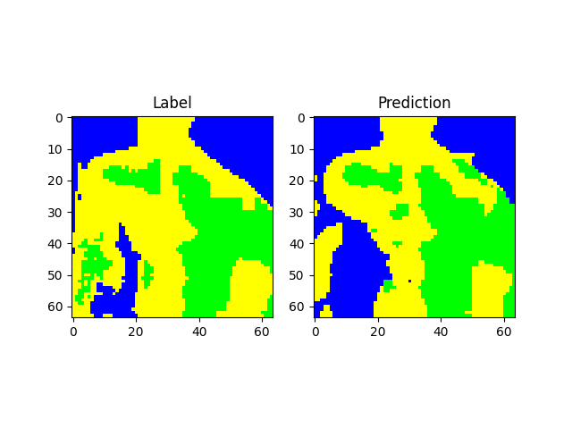
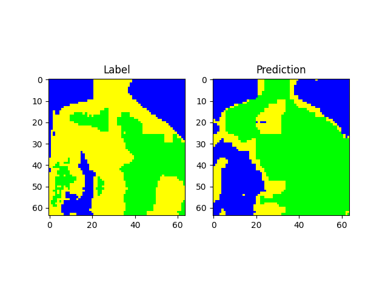

# Segmentation-Task
Implementation of UNET Segmentation model on Mutlispectral Satellite images.

# Results
### Training with all the channels
Accuracy : 0.9563
IOU : 0.8772

### Training with (r, g, b) channels
Accracy : 0.9068
IOU : 0.7575

# Graph Results
### Training with Multispectral

### Training with RGB

